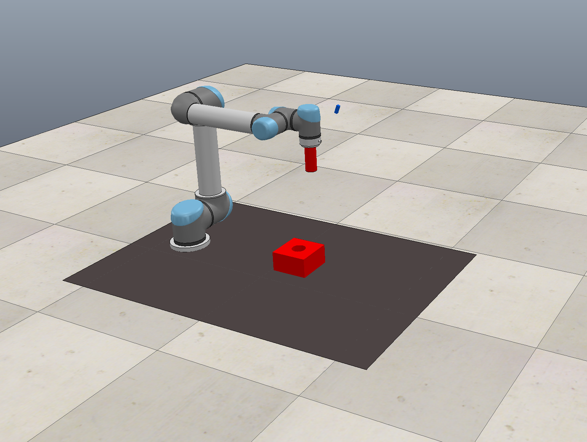
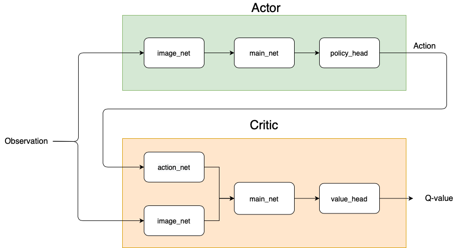
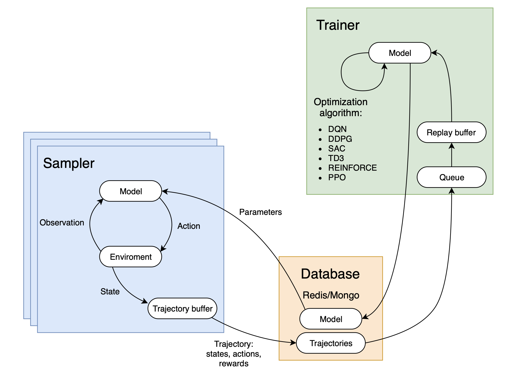
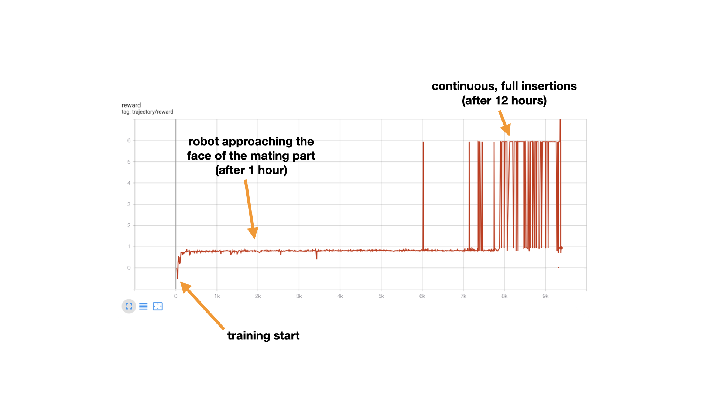
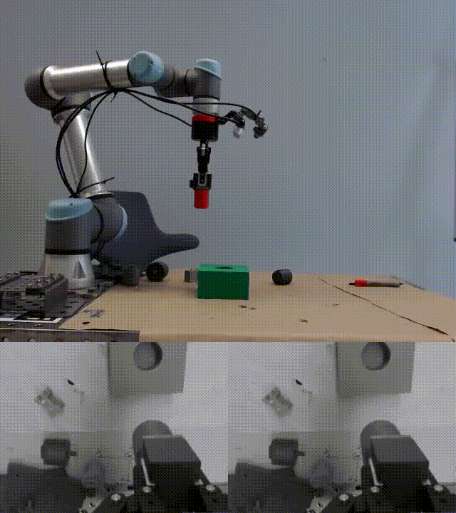
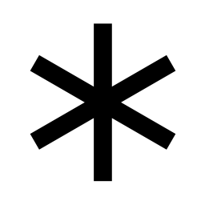

# Robotic Assembly using Deep Reinforcement Learning


## Introduction
One of the most exciting advancements, that has pushed the frontier of the Artificial Intelligence (AI) in recent years, is Deep Reinforcement Learning (DRL). DRL belongs to the family of machine learning algorithms. It assumes that intelligent machines can learn from their actions similar to the way humans learn from experience. Over the recent years we could witness some impressive [real-world applications of DRL](https://neptune.ai/blog/reinforcement-learning-applications). The algorithms allowed for major progress especially in the field of robotics. If you are interested in learning more about DRL, we encourage you to get familiar with the exceptional [**Introduction to RL**](https://spinningup.openai.com/en/latest) by OpenAI. We believe this is the best place to start your adventure with DRL.

The **goal of this tutorial is to show how you can apply DRL to solve your own robotic challenge**. For the sake of this tutorial we have chosen one of the classic assembly tasks: peg-in-hole insertion. By the time you finish the tutorial, you will understand how to create a complete, end-to-end pipeline for training the robot in the simulation using DRL.

The accompanying code together with all the details of the implementation can be found in our [GitHub repository](https://github.com/arrival-ltd/catalyst-rl-tutorial).

## Setup
1. Download the **robot simulation platform**, CoppeliaSim, from [the official website](https://www.coppeliarobotics.com/downloads). This tutorial is compatible with the version 4.1.0. 

2. Setup **toolkit for robot learning research**, PyRep, from their [github repository](https://github.com/stepjam/PyRep). PyRep library is built on top of CoppeliaSim to facilitate prototyping in python. 

3. Create **an environment for the RL agent**: It could be either a simulation or a real environment. We limit ourselves to simulation for faster prototyping and training. The agent interacts with the environment to collect experience. This allows it to learn a policy which maximizes the expected (discounted) sum of future rewards and hence solves the designed task. Most RL practitioners are familiar with the [OpenAI Gym environments](https://gym.openai.com/envs/#classic_control), a toolkit with toy environments used for developing and benchmarking reinforcement learning algorithms. However, our use case, robotic assembly task, is very specific. The goal is to train a robot to perform peg-in-hole insertion. This is why we created our simulation environment in [CoppeliaSim](https://www.coppeliarobotics.com). The simulator comes with various robot manipulators and grippers. For our tutorial, we picked UR5 robot with RG2 gripper (Figure 1).
    

   <em>Figure 1: UR5 manipulator with a peg attached to its gripper. The mating part is placed on the ground in the scene. CoppeliaSim caters to a variety of different robotic tasks. Feel free to come up with your own challenge and design your own simulation! [RLBench](https://github.com/stepjam/RLBench/tree/master/rlbench/task_ttms) (the robot learning benchmark and learning environment) also provides more off-the-shelf, advanced simulation environments. </em> 

4. Create **a gym environment wrapped around the simulation scene**:  

```python
import os
import cv2
import logging
import numpy as np

from gym import Space
from gym.spaces.box import Box
from gym.spaces.dict import Dict
from pyrep import PyRep, objects

from catalyst_rl.rl.core import EnvironmentSpec
from catalyst_rl.rl.utils import extend_space


class CoppeliaSimEnvWrapper(EnvironmentSpec):
    def __init__(self, visualize=True,
                 mode="train",
                 **params):
        super().__init__(visualize=visualize, mode=mode)

        # Scene selection
        scene_file_path = os.path.join(os.getcwd(), 'simulation/UR5.ttt')

        # Simulator launch
        self.env = PyRep()
        self.env.launch(scene_file_path, headless=False)
        self.env.start()
        self.env.step()

        # Task related initialisations in Simulator
        self.vision_sensor = objects.vision_sensor.VisionSensor("Vision_sensor")
        self.gripper = objects.dummy.Dummy("UR5_target")
        self.gripper_zero_pose = self.gripper.get_pose()
        self.goal = objects.dummy.Dummy("goal_target")
        self.goal_STL = objects.shape.Shape("goal")
        self.goal_STL_zero_pose = self.goal_STL.get_pose()
        self.grasped_STL = objects.shape.Shape("Peg")
        self.stacking_area = objects.shape.Shape("Plane")
        self.vision_sensor = objects.vision_sensor.VisionSensor("Vision_sensor")

        self.step_counter = 0
        self.max_step_count = 100
        self.target_pose = None
        self.initial_distance = None
        self.image_width, self.image_height = 320, 240
        self.vision_sensor.set_resolution((self.image_width, self.image_height))
        self._history_len = 1

        self._observation_space = Dict(
                {"cam_image": Box(0, 255,
                                  [self.image_height, self.image_width, 1],
                                  dtype=np.uint8)})

        self._action_space = Box(-1, 1, (3,))
        self._state_space = extend_space(self._observation_space, self._history_len)

    @property
    def history_len(self):
        return self._history_len

    @property
    def observation_space(self) -> Space:
        return self._observation_space

    @property
    def state_space(self) -> Space:
        return self._state_space

    @property
    def action_space(self) -> Space:
        return self._action_space

    def step(self, action):
        done = False
        info = {}
        prev_distance_to_goal = self.distance_to_goal()

        # Make a step in simulation
        self.apply_controls(action)
        self.env.step()
        self.step_counter += 1

        # Reward calculations
        success_reward = self.success_check()
        distance_reward = (prev_distance_to_goal - self.distance_to_goal()) / self.initial_distance

        reward = distance_reward + success_reward

        # Check reset conditions
        if self.step_counter > self.max_step_count:
            done = True
            logging.info('--------Reset: Timeout--------')
        elif self.distance_to_goal() > 0.8:
            done = True
            logging.info('--------Reset: Too far from target--------')
        elif self.collision_check():
            done = True
            logging.info('--------Reset: Collision--------')

        return self.get_observation(), reward, done, info

    def reset(self):
        logging.info("Episode reset...")
        self.step_counter = 0
        self.env.stop()
        self.env.start()
        self.env.step()
        self.setup_scene()
        observation = self.get_observation()
        return observation
# -------------- all methods above are required for any Gym environment, everything below is env-specific --------------

    def distance_to_goal(self):
        goal_pos = self.goal.get_position()
        tip_pos = self.gripper.get_position()
        return np.linalg.norm(np.array(tip_pos) - np.array(goal_pos))

    def setup_goal(self):
        goal_position = self.goal_STL_zero_pose[:3]
        # 2D goal randomization
        self.target_pose = [goal_position[0] + (2 * np.random.rand() - 1.) * 0.1,
                            goal_position[1] + (2 * np.random.rand() - 1.) * 0.1,
                            goal_position[2]]
        self.target_pose = np.append(self.target_pose,
                                     self.goal_STL_zero_pose[3:]).tolist()
        self.goal_STL.set_pose(self.target_pose)

        # Randomizing the RGB of the goal and the plane
        rgb_values_goal = list(np.random.rand(3,))
        rgb_values_plane = list(np.random.rand(3,))
        self.goal_STL.set_color(rgb_values_goal)
        self.stacking_area.set_color(rgb_values_plane)

        self.initial_distance = self.distance_to_goal()

    def setup_scene(self):
        self.setup_goal()
        self.gripper.set_pose(self.gripper_zero_pose)

    def get_observation(self):
        cam_image = self.vision_sensor.capture_rgb()
        gray_image = np.uint8(cv2.cvtColor(cam_image, cv2.COLOR_BGR2GRAY) * 255)
        obs_image = np.expand_dims(gray_image, axis=2)
        return {"cam_image": obs_image}

    def collision_check(self):
        return self.grasped_STL.check_collision(
            self.stacking_area) or self.grasped_STL.check_collision(self.goal_STL)

    def success_check(self):
        success_reward = 0.
        if self.distance_to_goal() < 0.01:
            success_reward = 0.01
            logging.info('--------Success state--------')
        return success_reward

    def apply_controls(self, action):
        gripper_position = self.gripper.get_position()
        # predicted action is in range (-1, 1) so we are normalizing it to physical units
        new_position = [gripper_position[i] + (action[i] / 200.) for i in range(3)]
        self.gripper.set_position(new_position)
```
For our reinforcement learning project we use [Catalyst RL](https://github.com/Scitator/catalyst-rl-framework), a distributed framework for reproducible RL research. This is just one of the elements of the marvellous [Catalyst](https://github.com/catalyst-team/catalyst) project. Catalyst is a [PyTorch ecosystem](https://pytorch.org/ecosystem/) framework for Deep Learning research and development. It focuses on reproducibility, rapid experimentation and codebase reuse. This means that the user can seamlessly run training loop with metrics, model checkpointing, advanced logging and distributed training support without the boilerplate code. We strongly encourage you to get familiar with the [Intro to Catalyst](https://medium.com/pytorch/catalyst-101-accelerated-pytorch-bd766a556d92) and incorporating the framework into your daily work!

We reuse its general Catalyst RL environment (`EnvironmentSpec`) class to create our custom environment. By inheriting from the `EnvironmentSpec`, you can quickly design your own environment, be it an [Atari game](https://gym.openai.com/envs/#atari), [classic control task](https://gym.openai.com/envs/#classic_control) or [robotic simulation](https://gym.openai.com/envs/#robotics). Finally, we specify states/observations, actions and rewards using OpenAI's gym [spaces](https://gym.openai.com/docs/#spaces) type. 

### A brief summary of the `CoppeliaSimEnvWrapper` in `src/env.py` 

This class wraps around the general RL environment class to launch the CoppeliaSim with our custom scene. Additionally, in the beginning of every episode, it initialises the properties of the mating part: 2D position in the workspace (`setup_goal()` method), as well as its colour.

The environment wrapper contains following methods:

* `get_observation()`, capture a grayscale image as an observation.

*  `distance_to_goal()`, compute the distance between the target and current position. The distance is used in reward design.
   
*  `success_check()`, check whether the goal state is reached. If yes, significantly boost agent's reward.
   
* `collision_check()`, check whether an agent collided with any object.
  

Episode termination occurs when the robot gets too far from the target, collides with any object in the environment or exceeds the maximum number of time steps. Those conditions are specified at the end of `step()` method and are checked at each step taken in the environment by the agent. Once the episode terminates, the whole cycle is repeated for the next episode.  

### Defining the RL algorithm

So far we have created an environment and specified how the agent can act (action space) and what the agent observes (observation space). But the intelligence of the robot is determined by the neural network. This "brain" of the robot is being trained using Deep Reinforcement Learning. Depending on the modality of the input (defined in `self.observation_space` property of the environment wrapper) , the architecture of agent's brain changes. It could be a multi-layer perceptron (MLP) or a convolutional neural network (CNN).
Catalyst provides an easy way to configure an agent using a `YAML` file. Additionally, it provides implementations of state-of-the-art RL algorithms like `PPO, DDPG, TD3, SAC` etc. One could pick the type of the algorithm by changing `algorithm:` variable in `configs/config.yml`. The hyper-parameters related to training can also be configured here.

In this tutorial, an off-policy, model-free RL algorithm [TD3](https://arxiv.org/pdf/1802.09477.pdf) is used. 

 

<em>Figure 2: Architecture of the actor and critic in our TD3 algorithm.</em> 

As depicted in Figure 2, the actor and critic(s) (TD3 concurrently learns two value networks) are modelled as `agent` classes in Catalyst. We customize them and configure the config file by setting `agent: UR5Actor` and `agent: UR5StateActionCritic`. The details of the neural network architecture for both actor and critic(s) can be configured by further editing the `YAML` file.

The CNN network `image_net`, used to process camera images, can be created as shown below. The layers of network are defined by  `channels `, `bias `,  `dropout `, `normalization ` (booleans)  and `activation ` functions (strings). These parameters are used by the function `get_convolution_net` in `src/network.py`.     

```
image_net_params:
   history_len: *history_len
   channels: [16, 32, 32, 32, 16]
   use_bias: True
   use_groups: False
   use_normalization: True
   use_dropout: False
   activation: ReLU
```
A MLP can be created using the block shown below. In our example, `main_net`, `action_net` are created
in similar fashion through `get_linear_net` function.

```
features: [64, 64]
use_bias: False
use_normalization: False
use_dropout: False
activation: ReLU

```
Once the actor and critic network architectures are defined, we are ready to start the training.

## Training
 <em> Figure 3: **Samplers** explore the environment and collect the data. **Trainer** uses the collected data to train a policy. Both the trainer and samplers are also configurable in `configs/config.yml`. The sampler starts with a random policy and after certain transitions, governed by `save_period` variable, the sampler updates its policy with the latest trainer weights. As the training progresses, the sampler keeps on gathering data collected by better policies while the trainer improves the policy until convergence. All the collected data is stored in a database. Source: [Sample Efficient Ensemble Learning with Catalyst.RL](https://arxiv.org/pdf/2003.14210.pdf). </em> 

Once the parameters of trainer and sampler (in the tutorial we use a single sampler) are configured, the training process can be started by launching `scripts/run-training.sh`. 

This opens a tmux session, which starts sampler, trainer, database, and tensorboard to monitor the training process.

**Once you clone our repository, install CoppeliaSim and PyRep, you are ready to start training**. Even though Catalyst is very much focused on reproducibility, due to asynchronous manner of training we can not guarantee the convergence of the training pipeline. If you don't see a progress of the robot after ~1h of training, you can try changing random seed, noise and action step values. In any case, we encourage you to play with the parameters and alter the code to your liking. 

**You can launch the pipeline by running** `scripts/run-training.sh`. The moment the training starts, the agents progress can be also monitored visually in the CoppeliaSim simulation.

## Final Results

<em>Figure 4: Reward per episode, collected over around 10k episodes.</em>

Once the policy converges, you can either test it (run inference) in the simulator or directly on the real robot. This is can be done by editing `configs/config_inference.yml` and passing the path of converged policy (.pth file) to `resume:` variable.  Finally, launch run `scripts/run-inference.sh`.

### **Inference on a real robot**  


## About the Team
<p align="center">
  
</p>


This tutorial is based on the research done at [ARRIVAL](https://arrival.com/?gclid=CjwKCAjwnef6BRAgEiwAgv8mQby9ldRbN6itD_fEpRZ2TdgFBeKltK-EPSVPNUhvdoH2s8PnNAYMLxoC5OAQAvD_BwE) by the outstanding robotics team: 
* [Damian Bogunowicz](https://dtransposed.github.io)
* [Fedor Chervinskii](https://www.linkedin.com/in/chervinskii/)
* [Alexander Rybnikov](https://www.linkedin.com/in/aleksandr-rybnikov-9a264ab0/)
* [Komal Vendidandi](https://de.linkedin.com/in/komal-vendidandi). 

The team is creating flexible factories of the future for the assembly of Arrival electric vehicles. One of the topics we are actively working on is transferring the knowledge obtained in the simulation to the physical robot. We encourage you to check out our recent research publication: [Sim2Real for Peg-Hole Insertion with Eye-in-Hand Camera](https://arxiv.org/pdf/2005.14401.pdf). If you have any questions about the contents of that tutorial or simply want to chat about robots, feel free to reach out to us!


